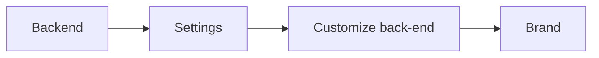
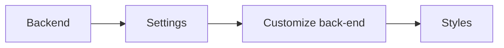

# Dark Backend

Plugin for Winter CMS

This plugin adds a dark theme switch to the user’s menu in backend of site. Now you can switch to dark theme for backend in one click.


See [Plugin screenshot gallery](https://github.com/WebVPF/wn-darkbackend-plugin/issues/6)

## Installation Сomposer:

```bash
composer require webvpf/wn-darkbackend-plugin
```

## Styles

When dark mode is enabled, the plugin script adds `dark` class for `body` tag. Therefore, to override the standard styles, you need to add `body.dark` before the selector name.

```css
body.dark .className {

}
```

### CSS Variables

The plugin adds css variables to the backend:

```css
:root {
    --drk-bg-color-a: #0d1117;
    --drk-bg-color-b: #161b22;
    --drk-bg-color-c: #1b222c;
    --drk-bg-color-btn: #21262d;
    --drk-bg-color-inset: #010409;
    --drk-bg-color-fancy: #254a5f;
    --drk-color: #c9d1d9;
    --drk-color-danger: #f85149;
    --drk-border-color: #30363d;
    --drk-box-shadow: 0 8px 24px #010409;
}
```

An example of using css variables:

```css
body.dark .myClassName {
    background: var(--drk-bg-color-a);
}
```

### Logo

You can upload your logo for backend customization in **Customize back-end**



If your logo is not suitable for the dark theme, then you can upload a separate dark theme logo to the media and write the following styles in **Customize back-end**



```css
body.dark .wn-logo {
    background-image: url(/storage/app/media/logo-backend-dark.png);
}
body.dark .wn-logo-transparent {
    background-image: url(/storage/app/media/logo-backend-dark.png) !important;
}
```


## Events

Turning dark mode on and off triggers `modeDarkEnabled` and `modeDarkDisabled` events. You can set listeners for these events:

```js
document.addEventListener('modeDarkEnabled', () => {
    // code when dark mode is enabled
});

document.addEventListener('modeDarkDisabled', () => {
    // code when dark mode is disabled
});
```

## Translation for switch text

Write a comment here: https://github.com/WebVPF/wn-darkbackend-plugin/issues/1 where specify language code and translation for text **Dark Theme** in your language.

### How to find out language code

Open backend home page and in page code look at the value of `lang` attribute for `<html>` tag (e.g.: `lang="en"`). This is your language code.

---

Protect your eyes!
